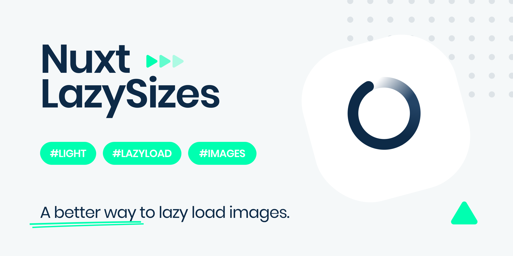

<p align="center">
    
</p>

<h1>Nuxt LazySizes</h1>

Lazysizes module for Nuxt.js

## Features

- Helps you integrate `lazysizes` image loader
- Allows you to easily set options through the module
- Boosts your lighthouse score and overall performance
- Provides a `lightweight`, `fast` and `reliable` solution
- Includes `zero-config` setup ready to go
- [and much more](https://github.com/aFarkas/lazysizes#what-makes-lazysizes-so-awesome) 🔥

## Setup

1. Add `nuxt-lazysizes` dependency to your project

```bash
$ npm install --save-dev nuxt-lazysizes
```

2. Add `nuxt-lazysizes` to the `buildModules` section of `nuxt.config.js`

```js
// nuxt.config.js

export default {
  buildModules: ['nuxt-lazysizes'],

  lazySizes: {
    /* module options */
  }
}
```

## Examples

`lazysizes` does not need any configuration. Add the class `lazyload` to your images/iframes in conjunction with a `data-src` and/or `data-srcset` attribute. Optionally you can also add a `src` attribute with a low quality image:

```js
// nuxt.config.js

{
  buildModules: ['nuxt-lazysizes']
}
```

```html
<!-- non-responsive: -->

```

```html
<!-- responsive example with automatic sizes calculation: -->

```

```html
<!-- iframe example -->
<iframe
  frameborder="0"
  class="lazyload"
  allowfullscreen=""
  data-src="//www.youtube.com/embed/ZfV-aYdU4uE"
>
</iframe>
```

[More info](https://github.com/aFarkas/lazysizes#how-to)

## Options

**JS API**

`lazysizes` automatically detects new elements with the class `lazyload` so you won't need to call or configure anything in most situations.

[More info](https://github.com/aFarkas/lazysizes#js-api)

```js
// nuxt.config.js

{
  /* Default options */
  lazySizes: {
    lazyClass: 'lazyload',
    loadedClass: 'lazyloaded',
    loadingClass: 'lazyloading',
    preloadClass: 'lazypreload',
    errorClass: 'lazyerror',
    autosizesClass: 'lazyautosizes',
    fastLoadedClass: 'ls-is-cached',
    iframeLoadMode: 0,
    srcAttr: 'data-src',
    srcsetAttr: 'data-srcset',
    sizesAttr: 'data-sizes',
    minSize: 40,
    customMedia: {},
    init: true,
    expFactor: 1.5,
    hFac: 0.8,
    loadMode: 2,
    loadHidden: true,
    ricTimeout: 0,
    throttleDelay: 125
  }
}
```

**CSS API**

`lazysizes` adds the class `lazyloading` while the images are loading and the class `lazyloaded` as soon as the image is loaded. This can be used to add unveil effects:

[More info](https://github.com/aFarkas/lazysizes#css-api)

```css
/* global css */

/* fade image in after load */
.lazyload,
.lazyloading {
  opacity: 0;
}

.lazyloaded {
  opacity: 1;
  transition: opacity 300ms;
}
```

```css
/* global css */

/* fade image in while loading and show a spinner as background image (good for progressive images) */

.lazyload {
  opacity: 0;
}

.lazyloading {
  opacity: 1;
  transition: opacity 300ms;
  background: #f7f7f7 url(loader.gif) no-repeat center;
}
```

## License

[MIT License](LICENSE)

Copyright (c) Ivo Dolenc
